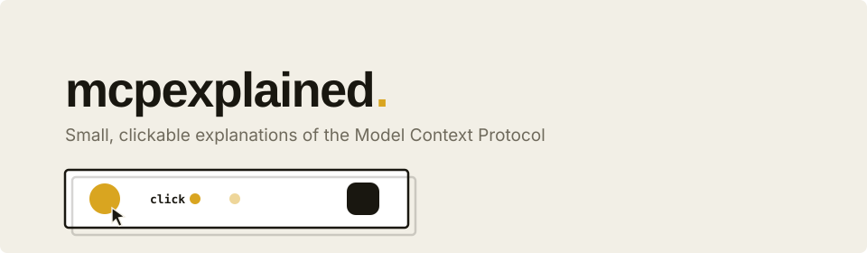

<p align="center">
  
</p>

# mcpexplained

**Small, clickable explanations of the Model Context Protocol.**

Short, content-driven essays where the diagrams are little machines you can
click. You send the requests, you flip the permissions, you approve the
payments — and the checklists tick off as you go. No animation libraries,
no videos: solid typography on paper, and animation only where it earns
the surprise.

**Live site:** https://reachjalil.github.io/mcpexplained/

## Essays

| # | Essay | Status |
|---|-------|--------|
| 01 | [Who can talk to whom?](https://reachjalil.github.io/mcpexplained/articles/who-can-talk-to-whom/) — MCP is a story about access: apps that have to ask, servers that stay strangers, and one agent holding all the keys. Five machines. | Live |
| 02 | Sessions are gone. Now what? | Planned |
| 03 | The task that outlived the request | Planned |

## Running locally

```bash
npm install
npm run dev        # http://localhost:3000
npm run check      # typecheck + lint + production build
```

Requires Node 20.9+. Fully static (`output: "export"`) — `npm run build`
produces a deployable `out/`.

## How a machine works

Three small pieces, all plain React + CSS + the Web Animations API:

1. **The stage** — [`components/machine/stage.ts`](components/machine/stage.ts).
   Actors register DOM nodes by name; `fly()` moves a dot between actor
   centres and resolves when it lands, so choreography reads as async code:

   ```ts
   await fly({ from: "app", to: "agent" });
   chip("agent", "app-visible ✓", "res");
   await fly({ from: "agent", to: "server" });
   ```

   `deny()` is the same but the packet hits a boundary: an ✕ pops and it
   falls. `pulse()` and `chip()` cover acknowledgement and speech.

2. **The card** — [`components/machine/Machine.tsx`](components/machine/Machine.tsx).
   White card, hard offset shadow, a stage, an optional controls row.
   After you've seen the point, a **rule** stamps onto the card — the same
   row language as the map at the end. Actors drop in with a small stagger
   the first time it scrolls into view.

3. **Goals** — [`components/machine/Goals.tsx`](components/machine/Goals.tsx).
   A checklist next to every machine. Toys report events; boxes pop when
   you've earned them.

Each essay's toys live in [`components/toys/`](components/toys/) — one file
per machine, nothing shared between essays except the kit above.

## Design rules

- **The reader does the work.** Every machine is driven by real clicks on
  real controls; goals only complete when the reader completes them.
- **One palette, learned once.** Amber pills are requests, teal pills are
  results. You are a dot, the agent is a ring, a server is a cut badge,
  red is a boundary saying no.
- **Animation is the reward, not the wallpaper.** Nothing moves until the
  reader (or the scroll) asks for it; `prefers-reduced-motion` collapses
  everything to near-instant.
- **Claims stay small.** One concept per essay, fine print where a draft
  spec is involved.

## License

[MIT](LICENSE). Essay prose is © its authors, also MIT — reuse with
attribution.
